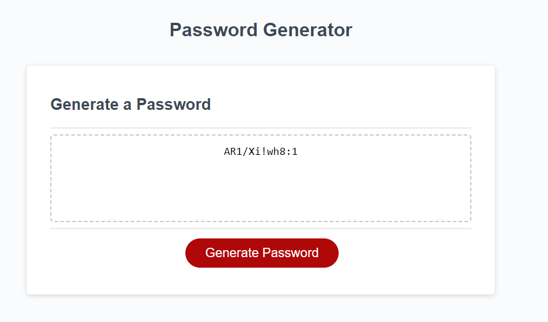
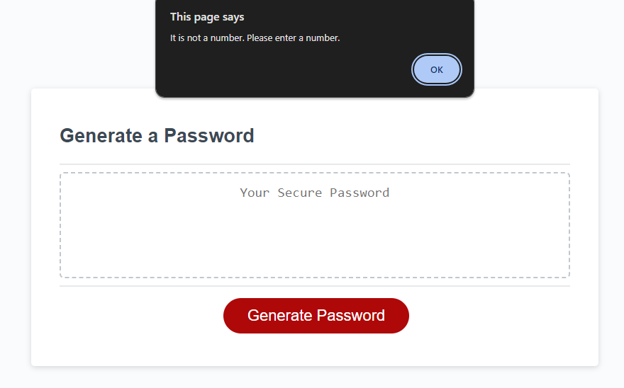

# Finances

## Description

It is a password generator.

## Installation

None.

## Usage

To use simply press Generate Password and then simply asnwer the questions. It has multiple choices of what can be added to the password result such as lowercase, uppercase,
numbers and special characters to create the password.
See below images as examples of features and function.

## Credits

None

## License

Please refer to the LICENSE in the repo.